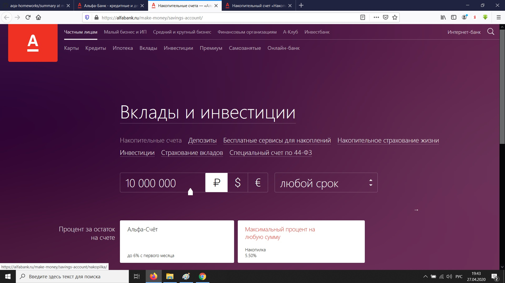

### 1. Перечень автоматизируемых сценариев

##### 1.1.    Открыть страницу "Главная" https://alfabank.ru/
##### 1.2.    Переход со страницы "Главная" https://alfabank.ru/ через всплывающее меню "Вклады" - "Накопилка" на страницу "Накопительный счет «Накопилка»" https://alfabank.ru/make-money/savings-account/nakopilka/

##### 1.3.    Переход со страницы "Карта сайта" https://alfabank.ru/sitemap/ через ссылку "Накопилка" на страницу "Накопительный счет «Накопилка»" https://alfabank.ru/make-money/savings-account/nakopilka/

##### 1.4.    Переход со страницы "Вклады и инвестиции" https://alfabank.ru/make-money/savings-account/ через ссылку "Максимальный процент на любую сумму" на страницу "Накопительный счет «Накопилка»" https://alfabank.ru/make-money/savings-account/nakopilka/

##### 1.5.    Переход со страницы "Накопительный счет «Накопилка»" https://alfabank.ru/make-money/savings-account/nakopilka/ на страницу "Анкета" https://alfabank.ru/make-money/savings-account/nakopilka/anketa/ через первую кнопку "Заполнить заявку".

##### 1.6.    Переход со страницы "Накопительный счет «Накопилка»" https://alfabank.ru/make-money/savings-account/nakopilka/ на страницу "Анкета" https://alfabank.ru/make-money/savings-account/nakopilka/anketa/ через вторую кнопку "Заполнить заявку".

##### 1.7.    Ввод валидных данных в анкете и получение подтверджения, что данные отправлены успешно.
##### 1.8.    Ввод невалидных данных в анкете и получение сообщения об ошибке.

### 2. Перечень используемых инструментов:

##### 2.1.    Java - язык программирования для создания автоматизированных тестов;
##### 2.2.    GitHub — сервис для удаленного хранения разрабатываемых автотестов и поддержания актуальных версий;
##### 2.3.    Git -  распределённая система управления версиями;
##### 2.4.    IntelliJ IDEA - интегрированная среда разработки программного обеспечения;
##### 2.5.    Gradle и Maven — системы автоматической сборки проекта;
##### 2.6.    Junit, Selenide, Selenium - популярный фреймворки для автоматизации тестирования;
##### 2.7.    Continuous Integration - это система для сборки и автоматизированного тестирования программного обеспечения;
##### 2.8.    Allure Framework – популярный инструмент построения отчётов автотестов, упрощающий их анализ;
##### 2.9.    Bug Tracking system - система отслеживания ошибок;

### 3. Перечень необходимых разрешений/данных/доступов от банка:

##### 3.1.    Доступ к тестовому режиму сервиса;
##### 3.2.    Доступ для работы с тестовой СУБД;
##### 3.3.    Разрешение СБ банка на проведение автоматизации тестирования тестового сервиса с доступом к тестовой СУБД;

### 4. Перечень и описание возможных рисков при автоматизации:

##### 4.1.    Трудозатраты на создание и поддержание автотестов выше чем затраты при ручном тестировании;
##### 4.2.    Необходимо отслеживать изменение фронтенда или бэкэнда, иначе тесты упадут;
##### 4.3.    Автотесты проверяют только то, на что запрограммированы  - можно пропустить баги;

### 5. Перечень необходимых специалистов для автоматизации:

##### 5.1.    QA-тестировщик;
##### 5.2.    Database Developer - разработчик БД;

### 6. Интервальная оценка с учётом рисков (в часах):

##### 6.1. Получение разрешений и доступов, подготовка и написание тестовых сценариев: 24 часа ( 3 рабочих дня);
##### 6.2. Разработка автотестов: 16 часов (2 рабочих дня);

### Во время выполнения задания были обнаружены Баги:

##### 1. При изменении размеров страницы "Вклады и инвестиции" https://alfabank.ru/make-money/savings-account/ ссылки не масштабируются:

##### 2. При вводе невалидных данных в анкете, мы не получаем сообщения об ошибке:

